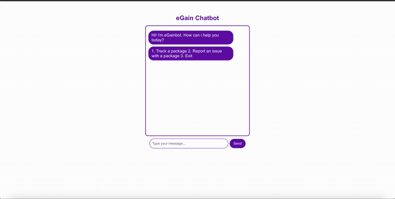

# eGain Chat Bot

a simple chatbot built with **react** that allows users to:

- track packages using a tracking number  
- report issues with packages  
- interact with a conversational menu  

## setup / installation

1. clone the repository:

```
git clone https://github.com/ponara/chatbot-egain.git
```
2. navigate to the project directory:

```
cd egain-chatbot
```
3. install dependencies:
```
npm install
```
4. start the development server:
```
npm start
```
5. open your browser and go to http://localhost:3000

## approach / explanation

built using react functional components with hooks (useState, useEffect, useRef) to manage messages and chat state.

conversation flow is handled with a simple state machine (mainMenu, askTracking, reportIssue, backToMenu, end).

package data is currently static, stored in a simple object, but can be extended to fetch from a database.

user input is validated (e.g., 6-character tracking numbers) and responses are dynamically added to the chat window.

chat window automatically scrolls to the latest message for a smooth user experience.

## chatbot in action


## unexpected user inputs

*invalid menu selection*

if the user enters something other than 1, 2, or 3 at the main menu, the bot responds:

“I’m sorry, I don’t understand. Please enter 1, 2, or 3.”

this ensures the user stays within the expected options and prevents the bot from breaking.

*invalid tracking number*

when the user enters a tracking number that does not match the 6-character alphanumeric format, the bot responds:

“Hmm, that doesn't look right. please enter a 6-character tracking number.”

additionally, if the tracking number is valid in format but not found in the data, the bot responds:

“I’m sorry, I can’t find a package with that number.”
